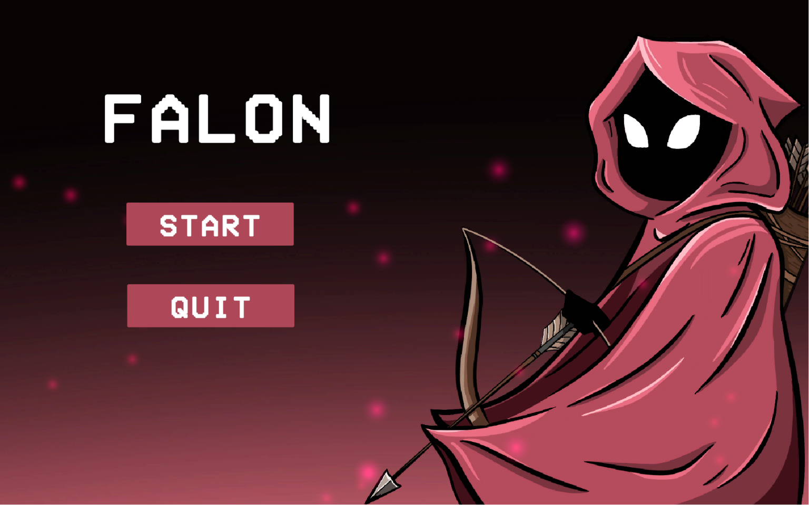

# FALON

**FALON** is a 2D platformer built in Unity, inspired by Metroidvania-style games. You play as Falon, an archer exploring an underground world split into several levels, each representing a different layer of the Earth. Fight enemies, collect coins and apples, and defeat the final boss to complete the game — or unlock the optional Secret Level by meeting extra requirements.



## Tech Stack

- **Engine:** Unity 6 (Editor 6000.2), Unity Hub 3.16.2
- **Language:** C#
- **Physics/Rendering:** Unity 2D (Rigidbody2D, Tilemap, Sprite Renderer, Sorting Layers)
- **Other tools used:** Procreate (menu backgrounds), LibreSprite (pixel art & animations), Audacity (sound editing)

## Project Structure

- **`Scripts/`** — All gameplay C# scripts:
  - `PlayerMovement.cs` — Falon's movement, jumping, climbing, shooting, and death.
  - `EnemyMovement.cs` — shared logic for small enemies (patrol + direction flip on trigger exit).
  - `BossMovement.cs` — final boss health and defeat logic.
  - `Arrow.cs` — projectile behavior on hitting enemies/boss/terrain.
  - `GameSession.cs` — persists across scenes (lives, score, enemy count, UI, music/audio transitions).
  - `ScenePersist.cs` — keeps collected coins/apples destroyed on level reload; reset on full Game Over.
  - `CoinPickUp.cs` / `ApplePickUp.cs` — collectible logic (score and healing items).
  - `LevelExit.cs` — loads the next level through the exit portal.
  - `StartMenu.cs` / `EndMenu.cs` — main menu and game-over screen logic.
  - `SceneFader.cs` — audio/visual transition between scenes.
  - `AudioManager.cs` — background music and sound effect handling.
- **`Prefabs/`** — Reusable objects (Player, enemy variants, coins, apple, arrow, portals, camera, managers).
- **`Scenes/`** — `StartScreen`, `Level 1–4`, `Secret Level`, `GameOverScreen`.
- **`Animations/`** — Animator controllers and sprite animations.
- **`Materials/`** — 2D materials/sprite assets.
- **`Audios/`** — Music tracks and sound effects.

## How to Run

1. Install [Unity Hub](https://unity.com/download) and Unity Editor **6000.2** (or a compatible Unity 6 version) through it.
2. Clone this repository:
   ```bash
   git clone https://github.com/Iuli1234/FalonUnityGame.git
   ```
3. Open Unity Hub → **Add project** → select the cloned folder.
4. Once the project loads in the Editor, open the `StartScreen` scene from `Scenes/`.
5. Press **Play** in the Unity Editor to run the game.

### Minimum Requirements to Build/Run
- OS: Windows 7 SP1+, macOS 10.13+, or Ubuntu 20.04+
- CPU: Dual-core (e.g. Intel Core i3 or equivalent)
- RAM: 2 GB (4 GB recommended)
- GPU: Integrated graphics with DirectX 10 / OpenGL 3.2 support
- Storage: ~200 MB

## Gameplay Overview

- **Levels 1–4:** progressively harder, from a guided tutorial level to a final boss fight.
- **Secret Level:** unlocked only if the player finishes with at least 10 enemies defeated (boss included), 1200 coins collected, and at least one life remaining.
- **Collectibles:** gold coins (100 pts) and emerald coins (200 pts) add to the score; apples restore a life if not already full.

## Credits

Made by **Codrean Iulia** as a high school computer science certification project (*Colegiul Național "Preparandia – Dimitrie Țichindeal"*, 2026).
